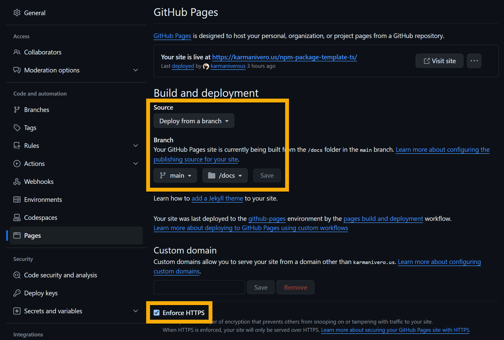

# TypeScript NPM Package Template

> _👇 Some of these badges only activate when you publish your package!_

[](https://www.npmjs.com/package/@karmaniverous/npm-package-template-ts)
 <!-- TYPEDOC_EXCLUDE -->
[](https://docs.karmanivero.us/npm-package-template-ts)
[](https://github.com/karmaniverous/npm-package-template-ts/tree/main/CHANGELOG.md)<!-- /TYPEDOC_EXCLUDE -->
[](https://github.com/karmaniverous/npm-package-template-ts/tree/main/LICENSE.md)

**Writing great TypeScript is only half the battle!** You also need to instrument it, format it, lint it, test it, bundle it, document it, and publish it!

Getting all of these pieces to work gracefully together is not trivial.

This template puts those pieces together in a way that just WORKS, right out of the box, so you can focus on your code. It includes fully-configured support for:

✅ [Code authoring](#code-authoring) with [TypeScript](https://www.typescriptlang.org/).<br>
✅ [Inline documentation](#inline-documentation) with [TSDoc](https://tsdoc.org/).<br>
✅ [CLI generation](#cli-generation) with [Commander](https://www.npmjs.com/package/commander).<br>
✅ [Code formatting](#formatting) with [Prettier](https://prettier.io/).<br>
✅ [Linting](#linting) with [ESLint](https://eslint.org/).<br>
✅ [Unit testing](#unit-testing) with [Vitest](https://vitest.dev/).<br>
✅ [Package pruning](#package-pruning) with [Knip](https://github.com/webpro-nl/knip).<br>
✅ [Bundling](#bundling) with [Rollup](https://rollupjs.org/).<br>
✅ [Publishing](#publishing) with [ReleaseIt](https://github.com/release-it/release-it).<br>
✅ [Git hooks](#git-hooks) with [Lefthook](https://github.com/evilmartians/lefthook).<br>
✅ [API documentation](#api-documentation) generated by [TypeDoc](https://typedoc.org/).<br>
✅ Recommended extensions & settings wherever appropriate.<br>

## Getting Started

Create a new repo using this template! When you clone it locally, be sure to run:

```bash
npm i                 # install dependencies
npx lefthook install  # install Git hooks
```

Also, type `@recommended` into the VSCode Extensions sidebar and install the recommended extensions!

Change all repository & personal references in [`package.json`](https://github.com/karmaniverous/npm-package-template-ts/tree/main/package.json) & [`typedoc.json`](https://github.com/karmaniverous/npm-package-template-ts/tree/main/typedoc.json) to reflect your own info.

Before your first commit, be sure to reset your project's version number (e.g. to `0.0.0`) in `package.json`.

To streamline the release process from your desktop, set up a GitHub [Personal Access Token](https://github.com/settings/tokens) and follow the instructions in [`.env.local.template`](https://github.com/karmaniverous/npm-package-template-ts/tree/main/.env.local.template).

## Code Authoring

You want to write straight TS code without having to jump through weird hoops like adding a `.js` extension to your TS imports. ([Click here](https://stackoverflow.com/questions/75807785/why-do-i-need-to-include-js-extension-in-typescript-import-for-custom-module) to dive into that hole. 🙄)

Long story short: you can. Just write your code in the `src` directory and import it as you would any other module. The [bundling process](#bundling) will take care of the rest.

## Inline Documentation

This template uses [TSDoc](https://tsdoc.org/) for inline documentation. TSDoc is similar to JSDoc, but is way less verbose as it can take advantage of TypeScript's type system. It also has better support for documenting generics and other TypeScript-specific features.

TSdoc comments are automatically included in your bundled code, so you can use them to document your code for IntelliSense in JavaScript as well as TypeScript.

The template also includes linting support for your TSDoc comments to keep you out of trouble. Just run `npm run lint` to check your comments along with the rest of your code, and be sure to check out the great [TSDoc documentation](https://tsdoc.org/) for more details!

Also note that this template generates [API Documentation](#api-documentation) with [TypeDoc](https://typedoc.org/). The TypeDoc spec includes a few tags that TSDoc doesn't support. [`tsdoc.json`](https://github.com/karmaniverous/npm-package-template-ts/tree/main/tsdoc.json) specifies these extra tags and ensures you can use them in your code without generating ESLint warnings!

## CLI Generation

This template uses [Commander](https://www.npmjs.com/package/commander) to generate a CLI for your package.

Given that your underlying library is solid, wrapping it into a CLI is fairly straightforward. Just follow these steps:

1. All of your CLI-specific code should live in the [`src/cli`](https://github.com/karmaniverous/npm-package-template-ts/tree/main/src/cli/) directory, but can import code from across your package as required. Each subdirectory here is the root of a CLI command. You can have as many as you want, but this template includes a single example called [`mycli`](https://github.com/karmaniverous/npm-package-template-ts/tree/main/src/cli/mycli/).

1. The `index.ts` file in each named CLI subdirectory will be picked up by the [bundler](#bundling) and compiled into a CLI command with the same name as the subdirectory. So `src/cli/mycli/index.ts` will be compiled into `dist/mycli.cli.mjs`.

1. The `bin` field in [`package.json`](https://github.com/karmaniverous/npm-package-template-ts/tree/main/package.json) must specifically reference each of these compiled CLI commands. On installation, you can then execute your CLI command like this:

```bash
> npx mycli      # if installed localy

> mycli          # if installed globally

# this is what you get...

Usage: mycli [options] [command]

My CLI tool

Options:
  -h, --help      display help for command

Commands:
  foo [options]   Foos your bar.
  help [command]  display help for command
```

Providing a detailed tutorial on Commander is really out of scope for this README, but this repo demonstrates a simple example with a single subcommand abstracted into a separate dependency.

You can build on this example to create a MUCH more complex CLI! See the [Commander documentation](https://www.npmjs.com/package/commander) for more details.

**If your project requires an extensive, config-driven CLI, you might want to use my [get-dotenv-child](https://github.com/karmaniverous/get-dotenv-child) template instead!**

## Formatting

Code formatting is provided by [Prettier](https://prettier.io).

Just run `npm run lint` to lint & format your code, or `npm run lint:fix` to resolve any issues automatically if possible.

The [Prettier extension](https://marketplace.visualstudio.com/items?itemName=esbenp.prettier-vscode) is included in the template's VSCode [workspace recommendations](https://github.com/karmaniverous/npm-package-template-ts/tree/main/.vscode/extensions.json), and the template contains related [workspace settings](https://github.com/karmaniverous/npm-package-template-ts/tree/main/.vscode/settings.json), so be sure to install recommended extensions when prompted!

## Linting

Linting services are provided by [ESLint](https://eslint.org).

Just run `npm run lint` to lint your code, or `npm run lint:fix` to resolve any issues automatically if possible. These commands also run Prettier to identify & fix formatting issues.

The [ESLint extension](https://marketplace.visualstudio.com/items?itemName=dbaeumer.vscode-eslint) is included in the template's VSCode [workspace recommendations](https://github.com/karmaniverous/npm-package-template-ts/tree/main/.vscode/extensions.json), and the template contains related [workspace settings](https://github.com/karmaniverous/npm-package-template-ts/tree/main/.vscode/settings.json), so be sure to install recommended extensions when prompted!

## Unit Testing

Unit test support is provided by [Vitest](https://vitest.dev).

Any file containing `.test.` in its name (e.g. [`foo.test.ts`](https://github.com/karmaniverous/npm-package-template-ts/tree/main/src/foo.test.ts)) will be treated as a test file and executed by Vitest. See [`vitest.config.ts`](https://github.com/karmaniverous/npm-package-template-ts/tree/main/vitest.config.ts) for configuration details.

Just run `npm run test` to execute your tests.

Test coverage reporting is provided by [Vitest](https://vitest.dev/guide/coverage.html) and runs every time you execute your tests. If you execute your tests from the command line, you will see a coverage report at the bottom of the run. You can also see a prettier version of this report by opening `coverage/lcov-report/index.html` in your browser.

The [Vitest extension](https://marketplace.visualstudio.com/items?itemName=ZixuanChen.vitest-explorer) is a great way to execute & debug your Vitest tests! It's included in the template's VSCode [workspace recommendations](https://github.com/karmaniverous/npm-package-template-ts/tree/main/.vscode/extensions.json), and the template contains related [workspace settings](https://github.com/karmaniverous/npm-package-template-ts/tree/main/.vscode/settings.json), so be sure to install recommended extensions when prompted!

## Package Pruning

[Knip](https://github.com/webpro-nl/knip) is a great command-line tool that finds unused files, dependencies and exports in your TypeScript project. Less code and dependencies lead to improved performance, less maintenance and easier refactorings!

This template integrates Knip into your build process so you can prune your package at every release. Edit the [config file](https://github.com/karmaniverous/npm-package-template-ts/blob/main/knip.json) to add any new cutouts, and run `npm run knip` to prune your package on demand!

## Bundling

This template uses [Rollup](https://rollupjs.org) to bundle your code. See the [References](#references) section for more detailed notes. It creates several kinds of outputs:

- ESM, for import into most TS/JS code.
- IIFE ([Immediately Invoked Function Expression](https://medium.com/@rabailzaheer/iife-explained-immediately-invoked-function-expressions-fccd8f53123d)), for direct browser import.
- CJS, for lulz.
- Type definition files to support TypeScript imports and power IntelliSense in Javascript.
- CLI commands for execution from your command line. See the [CLI Generation](#cli-generation) section for details. Don't forget to update the `bin` field in [`package.json`](https://github.com/karmaniverous/npm-package-template-ts/tree/main/package.json)!

Type declarations are properly bundled and should be available no matter how your package is imported.

Just run `npm run build` to bundle your code, and the output will be in the `dist` directory.

See [`rollup.config.ts`](https://github.com/karmaniverous/npm-package-template-ts/tree/main/rollup.config.ts) for details. If you don't need all of the output types listed above, it should be fairly straightforward to modify this file to suit your needs.

### Incremental Build Warning

Incremental builds are turned on in this template. This will save you some build time, but [`@rollup/plugin-typescript`](https://www.npmjs.com/package/@rollup/plugin-typescript) will emit the following warning at build time:

```bash
(!) [plugin typescript] @rollup/plugin-typescript: outputToFilesystem option is defaulting to true.
```

This is a [known issue](https://github.com/rollup/plugins/issues/1227) and should have no negative effect on your build. If you can figure out how to suppress this warning, please [submit a PR](https://github.com/karmaniverous/npm-package-template-ts/issues/11)!

### External Dependencies

[`rollup.config.ts`](https://github.com/karmaniverous/npm-package-template-ts/tree/main/rollup.config.ts) is configured to treat all non-dev and peer dependencies listed in `package.json` as external dependencies. This means...

- These dependencies will not be bundled into your package, but should be installed as a matter of course when you run `npm install`.

- Your distribution files will be located in your dist directory as specified in your `package.json` exports field (e.g. `dist/mjs/index.js`).

It is possible for external dependencies to creep into your build. For example, let's say you have a dev dependency that you referenced in runtime code, but is actually included as a runtime dependency by some other package. In this case...

- the dependency would _not_ be listed as an external dependency by `rollup.config.ts`, and

- your distribution files would shift to `dist/mjs/src/index.js`, breaking your package.

To prevent this, simply list the dependency as a regular dependency in your `package.json` file... **which is exactly where it belongs anyway!**

This will restore the structure of your build AND ensure proper tree-shaking of your dependencies.

## Publishing

This template uses [ReleaseIt](https://github.com/release-it/release-it) to create a release on GitHub and publish your package to NPM.

Just run `npm run release` and the following will happen:

- ESLint will lint your code.
- Vitest will execute your tests and assess code coverage. Open `coverage/lcov-report/index.html` to see the results.
- Rollup will bundle your code.
- TypeDoc will generate & commit your API documentation.
- ReleaseIt will create a release on GitHub and publish your package to NPM.

To preserve Git Flow integrity, `npm run release` will only run on the `main` branch. It is often useful, though, to create a pre-release version from a feature branch. To do this, run `npm run release:pre` on any branch.

See the `release-it` section in [`package.json`](https://github.com/karmaniverous/npm-package-template-ts/tree/main/package.json) for details.

## Validating Your Package

Use [this awesome utility](https://arethetypeswrong.github.io/) to validate that the types in your package are actually accessible in key target development environments.

## Git Hooks

This template assumes you will be using something like [Git Flow](https://www.atlassian.com/git/tutorials/comparing-workflows/gitflow-workflow) with a [strong Git branch naming convention](https://medium.com/@abhay.pixolo/naming-conventions-for-git-branches-a-cheatsheet-8549feca2534).

The template uses [Lefthook](https://evilmartians.com/opensource/lefthook) to perform two services:

- It will prevent you from committing to a branch with an invalid name. See the [`branch-naming-policy`](https://github.com/karmaniverous/npm-package-template-ts/tree/main/.lefthook/pre-commit/branch-naming-policy) script for details.

- If your branch name begins with a standard-format issue number (e.g. [GH-1](https://github.com/karmaniverous/npm-package-template-ts/issues/1)) it will prefix your commit message with the issue number. This is a great way to keep your commits organized and linked to the issues they address! See the [`add-issue`](https://github.com/karmaniverous/npm-package-template-ts/tree/main/.lefthook/prepare-commit-msg/add-issue) script for details.

To activate this functionality, be sure to run `npx lefthook install` after cloning the repository & installing dependencies!

## API Documentation

This is really slick!

If you've been careful to document your code according to [TSDoc](https://tsdoc.org/) conventions, then when you run `npm run docs` or `npm run build`, [TypeDoc](https://typedoc.org/) will generate API documentation, wrap it up with your README file, and publish it in browsable form to the `docs` directory of your repo.

You can alter the outcome by editing [`typedoc.json`](https://github.com/karmaniverous/npm-package-template-ts/tree/main/typedoc.json). See the [TypeDoc options documentation](https://typedoc.org/options/) for more info.

Update your repository's GitHub Pages settings as illustrated below, and this site will be published to `<your GitHub username>.github.io/<your repo name>`. You can also assign it a custom domain.



If you already have a custom domain set up for a GitHub Pages site at `<your GitHub username>.github.io`, this documentation will appear at `<your custom domain>/<your repo name>`.

For example, see https://docs.karmanivero.us/npm-package-template-ts.

Finally, note that this README file contains a link in the header to this documentation site that does NOT appear in the copy of the README on the documentation site's home page.

This is accomplished with the [`typedoc-plugin-replace-text`](https://www.npmjs.com/package/typedoc-plugin-replace-text) TypeDoc plugin. It's already installed & configured in this template, and using it is really simple. Just enclose any Markdown you'd like to exclude from the documentation site in a pair of special Markdown comment tags like this:

```md
<!-- TYPEDOC_EXCLUDE -->

> [API Documentation](https://karmaniverous.github.io/npm-package-template-ts)!

<!-- /TYPEDOC_EXCLUDE -->
```

Anything between these tags (as well as the tags themselves) will be excluded from the documentation site. Note that you can also use these tags to exclude content from your inline Typescript documenation!

Some tips:

- When TypeDoc finds a relative link in your README to an asset in your repo, it will copy that asset to the `media` directory of the documentation site. This is fine for images, but you probably want source code links to continue to point to the source code file in its original location. To accomplish this, just use the full URL to the file instead of a relative link.

> Do you know how to restrict this behavior to certain file extensions? [Start a discussion](https://github.com/karmaniverous/npm-package-template-ts/discussions) and let me know!

- The organization of your documentation site mostly reflects the organization of your code. So make full use of the [tags](https://typedoc.org/guides/tags/) supported by TypeDoc!

- I added convenient links in [`typedoc.json`](https://github.com/karmaniverous/npm-package-template-ts/tree/main/typedoc.json) to the project GitHub repository and my GitHub profile. You'll want to change these to reflect your own info.

Also note that this template generates [API Documentation](#api-documentation) with [TypeDoc](https://typedoc.org/). The TypeDoc spec includes a few tags that TSDoc doesn't support. [`tsdoc.json`](https://github.com/karmaniverous/npm-package-template-ts/tree/main/tsdoc.json) specifies these extra tags and ensures you can use them in your code without generating ESLint warnings!

## References

- [Building a TypeScript CLI with Node.js and Commander](https://blog.logrocket.com/building-typescript-cli-node-js-commander/)

- [Bundling TypeScript in different formats with rollup.js](https://datomarjanidze.medium.com/bundling-typescript-in-different-formats-with-rollup-js-3397b3a84e4e)

- [Naming conventions for Git Branches — a Cheatsheet](https://medium.com/@abhay.pixolo/naming-conventions-for-git-branches-a-cheatsheet-8549feca2534)

- [TypeScript and NPM package.json exports the 2024 way](https://www.kravchyk.com/typescript-npm-package-json-exports/). Note that [this snippet](https://www.kravchyk.com/typescript-npm-package-json-exports/#:~:text=the%20types%20may%20need%20to%20be%20.d.cjs) is wrong; it should read _the types may need to be `.d.cts`_. That's how this template is implemented. Also note that we're just using a second (and third) `rollup` type declarations target instead of employing [rollup-plugin-copy](https://www.npmjs.com/package/rollup-plugin-copy) as suggested in the article.

---

Built for you with ❤️ on Bali! Find more great tools & templates on [my GitHub Profile](https://github.com/karmaniverous).
